# Code2CGA Architecture Documentation

## Table of Contents
1. [System Overview](#system-overview)
2. [MVC Architecture Pattern](#mvc-architecture-pattern)
3. [Module Structure](#module-structure)
4. [Service Layer Architecture](#service-layer-architecture)
5. [Data Flow Architecture](#data-flow-architecture)
6. [Storage Architecture](#storage-architecture)
7. [Threading Model](#threading-model)
8. [Component Interactions](#component-interactions)
9. [Security Architecture](#security-architecture)
10. [Performance Architecture](#performance-architecture)

## System Overview

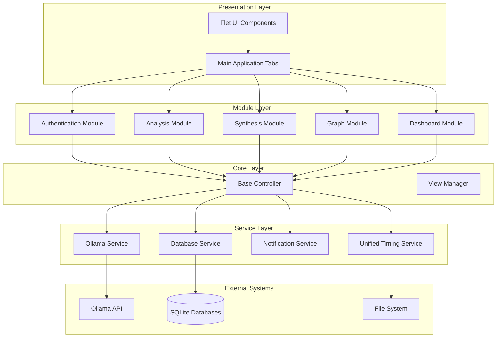

## MVC Architecture Pattern

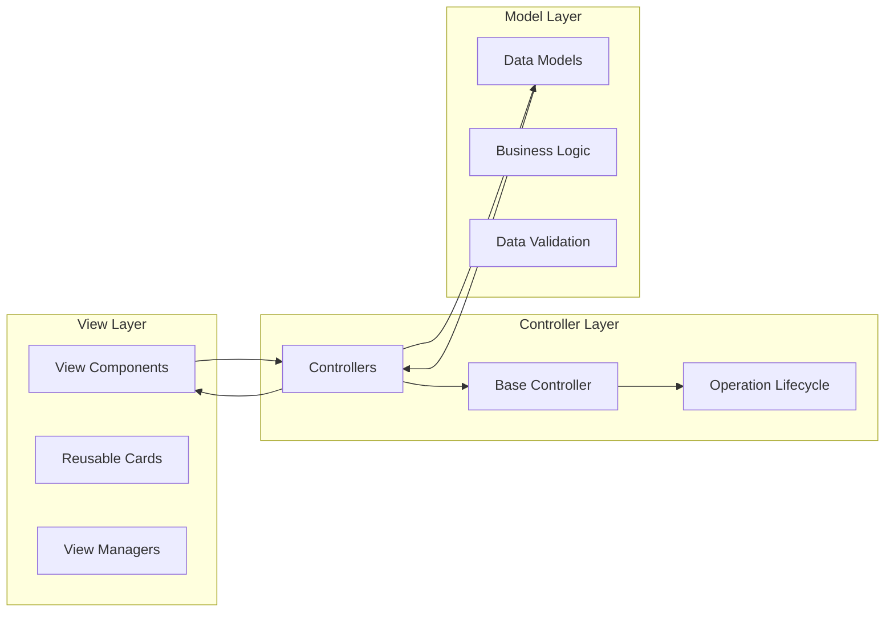

### Module MVC Structure

```mermaid
graph TB
    subgraph "Module: Analysis"
        AView[Analise View Manager]
        AComp[Components]
        ACtrl[Analise Controller]
        AModel[Analise Model]
    end

    subgraph "Module: Synthesis"
        SView[Sintese View Manager]
        SComp[Components]
        SCtrl[Sintese Controller]
        SModel[Sintese Model]
    end

    subgraph "Module: Graph"
        GView[Grafo View Manager]
        GComp[Components]
        GCtrl[Grafo Controller]
        GModel[Grafo Model]
    end

    subgraph "Module: Dashboard"
        DView[Dashboard View Manager]
        DComp[Components]
        DCtrl[Dashboard Controller]
        DModel[Dashboard Model]
    end

    AView --> AComp
    AComp --> ACtrl
    ACtrl --> AModel
    AModel --> ACtrl
    ACtrl --> AView

    SView --> SComp
    SComp --> SCtrl
    SCtrl --> SModel
    SModel --> SCtrl
    SCtrl --> SView

    GView --> GComp
    GComp --> GCtrl
    GCtrl --> GModel
    GModel --> GCtrl
    GCtrl --> GView

    DView --> DComp
    DComp --> DCtrl
    DCtrl --> DModel
    DModel --> DCtrl
    DCtrl --> DView
```

## Module Structure

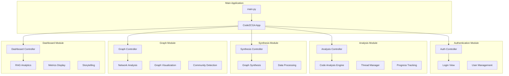

## Service Layer Architecture

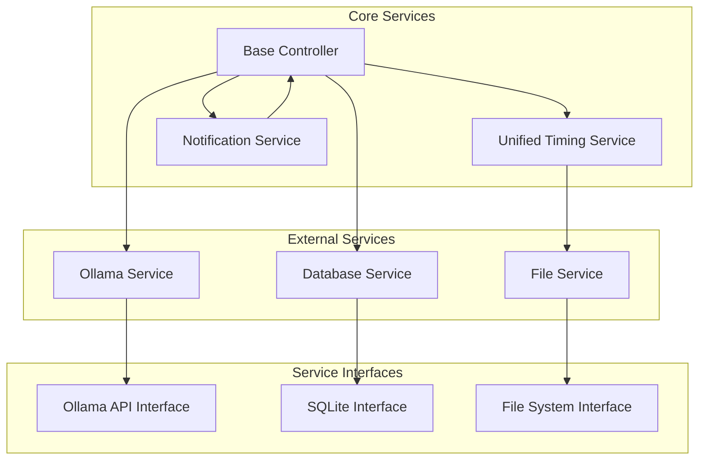

## Data Flow Architecture

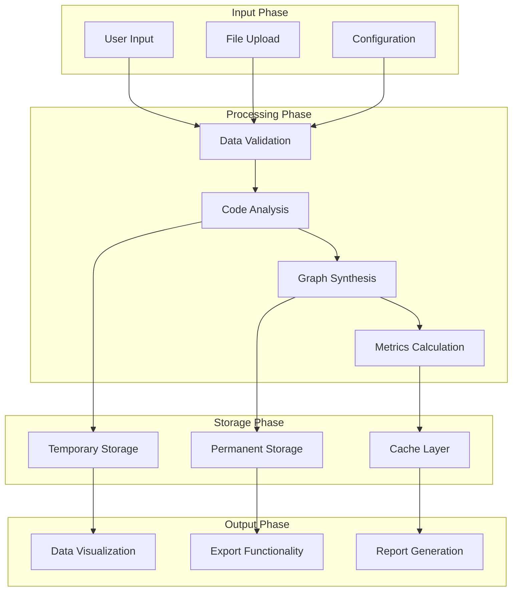

### Analysis Flow

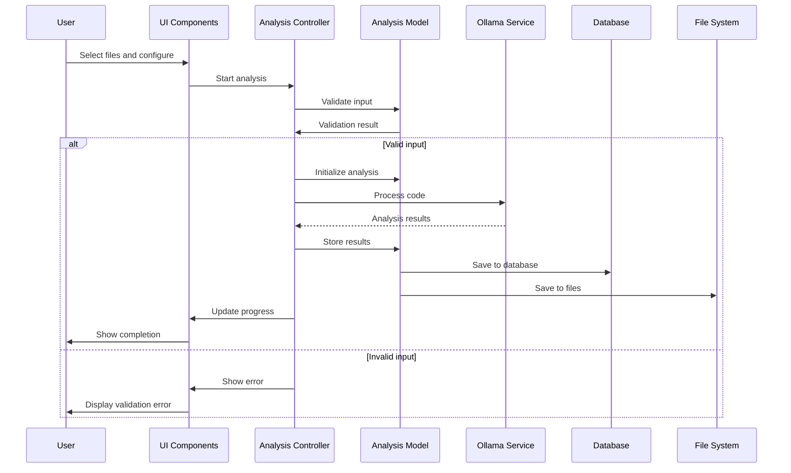

## Storage Architecture

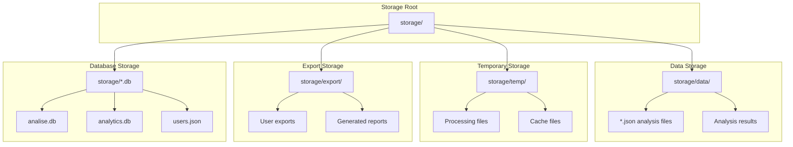

## Threading Model

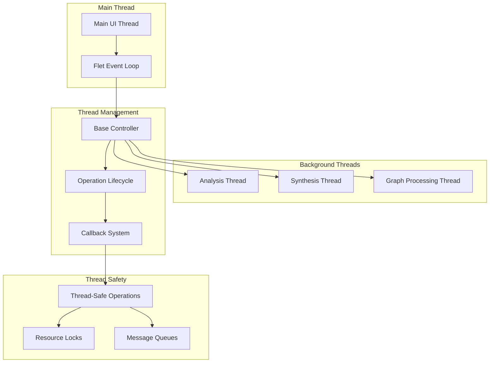

## Component Interactions

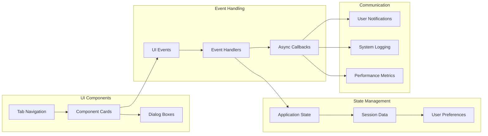

## Security Architecture

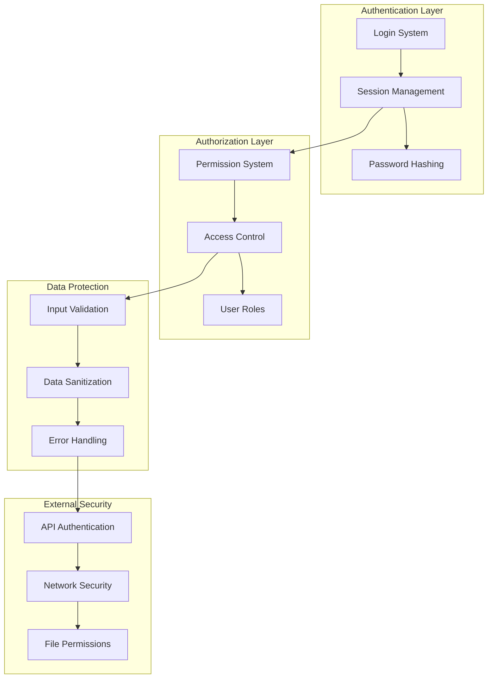

## Performance Architecture

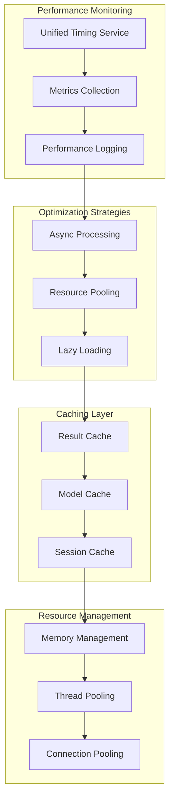

## Directory Structure

```
code2cga/
├── main.py                     # Application entry point
├── core/                       # Core framework components
│   ├── base_controller.py      # Base controller with lifecycle management
│   └── view_manager_template.py # Template for view managers
├── modules/                    # Functional modules
│   ├── analise/               # Code analysis module
│   │   ├── controller.py      # Analysis controller
│   │   ├── model.py           # Analysis model
│   │   └── view/              # View layer
│   │       ├── view_manager.py
│   │       └── components/    # Reusable UI components
│   ├── sintese/              # Graph synthesis module
│   │   ├── controller.py      # Synthesis controller
│   │   ├── model.py           # Synthesis model
│   │   └── view/              # View layer
│   ├── grafo/                # Graph visualization module
│   │   ├── controller.py      # Graph controller
│   │   ├── model.py           # Graph model
│   │   └── view/              # View layer
│   ├── dashboard/            # Analytics dashboard
│   │   ├── controller.py      # Dashboard controller
│   │   ├── model.py           # Dashboard model
│   │   └── view/              # View layer
│   └── auth/                 # Authentication module
│       ├── controller.py      # Auth controller
│       └── view/              # Login view
├── services/                   # Support services
│   ├── ollama_service.py      # Ollama integration
│   ├── notification_service.py # Notification system
│   ├── database_service.py    # Database operations
│   └── unified_timing_service.py # Timing and metrics
├── storage/                    # Persistent data storage
│   ├── analise.db             # SQLite: Analysis results
│   ├── analytics.db           # SQLite: System metrics
│   ├── users.json             # User authentication
│   ├── data/                  # JSON analysis files
│   ├── temp/                  # Temporary files
│   └── export/                # User exports
├── log/                        # Application logs
├── explicabilidade/            # Explainability artifacts
├── inspecao/                   # Inspection files
└── docs/                       # Documentation
```

## Key Design Principles

1. **Modularity**: Each module is self-contained with clear boundaries
2. **Separation of Concerns**: MVC pattern ensures clean separation
3. **Async Processing**: Long-running operations don't block UI
4. **Centralized Services**: Shared services reduce duplication
5. **Event-Driven**: UI responds to events through callbacks
6. **Thread Safety**: Proper synchronization for concurrent operations
7. **Resource Management**: Efficient use of memory and connections
8. **Extensibility**: Easy to add new modules and features

This architecture documentation provides a comprehensive view of the Code2CGA system using Mermaid diagrams to visualize various aspects of the system's structure, data flow, and interactions. The diagrams follow the actual implementation patterns found in the codebase and illustrate the relationships between components, modules, and services.